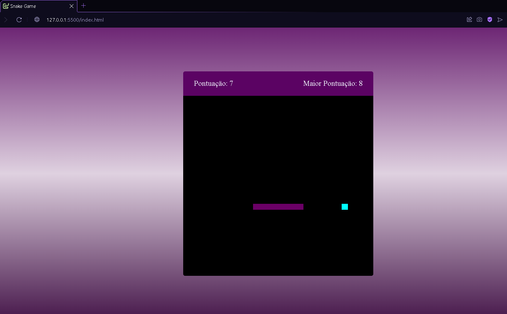

# SNAKE-GAME

# Sobre o projeto

## Projeto do jogo da cobrinha no qual utilizo o localstorage para armazenar a pontuação do jogador.

## Layout principal

 


# Tecnologias utilizadas

- JavaScript
- HTML / CSS 

# Como executar o projeto

```bash
# clonar repositório
https://github.com/JGMeneses/Jogo-Snake.git
# utilizar a extensão do Vscode GoLive.

```

# Autor

João Victor Gomes Meses
